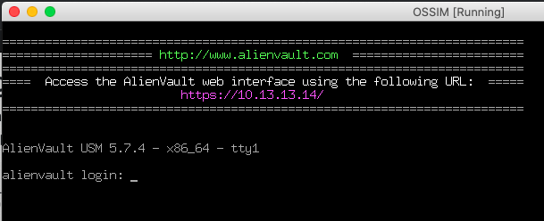
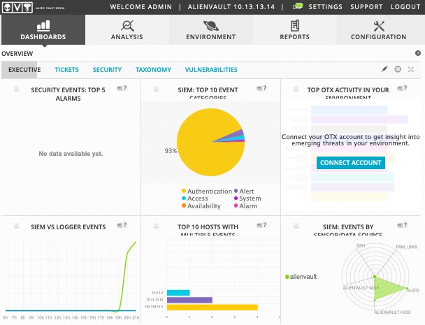
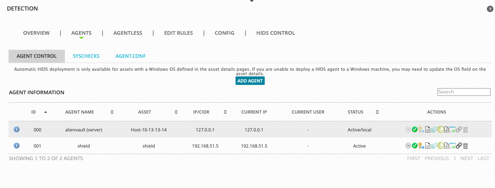
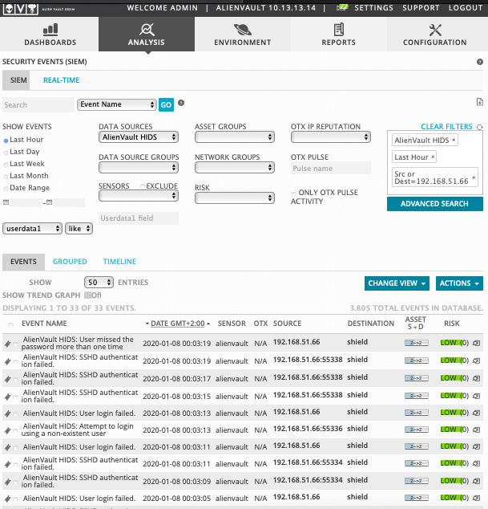

### Изучить платформу OSSIM и OSSEC для регистрации событий безопасности.

#### 1. Установить и настроить систему OSSIM (на сервер или виртуалку).

Установка будет выполнена на виртуальную машину VirtualBox, используя образ AlienVault_OSSIM_64bits.iso, загруженный с сайта https://cybersecurity.att.com/products/ossim  
Выделенные ресурсы:  
CPU:2; RAM:3G; HDD:80G;  
eth0:сетевой мост (10.13.13.14/24 - для управления);  
eth1:виртуальный адаптер хоста (192.168.51.80/24 - для сбора логов).

Во время установки в ручном режиме добавляю Linux-станцию shield (192.168.51.5).

  

#### 2. Развернуть виртуалку на базе CentOS.

Виртуальной машиной на базе CentOS будет ранее установленная для курса машина shield (192.168.51.5/24).

#### 3. Установить на нее хостовый агент OSSEC HIDS и зарегистрировать агента в OSSIM.

<pre>
yum install wget  
wget -q -O - https://updates.atomicorp.com/installers/atomic | sh  
yum install ossec-hids ossec-hids-agent  

cd /var/ossec/bin  
./ossec-configure 

OSSEC Configuration utility v0.1

1- What kind of installation do you want? (server, agent, local) [Default: server]: agent

2- Setting up the configuration environment.

3- Configuring the OSSEC HIDS.

  3.1- Do you want e-mail notification? (y/n) [Default: y]: n

  3.2- Do you want to run the integrity check daemon? (y/n) [y]: 

  3.3- Do you want to run the rootkit detection engine? (y/n) [y]: 

  3.4- Active response allows you to execute a specific 
       command based on the events received. For example,
       you can block an IP address or disable access for
       a specific user.  
       More information at:
       http://www.ossec.net/en/manual.html#active-response
       

   - Do you want to enable active response? (y/n) [y]: n

  3.5- Do you want to enable remote syslog (port 514 udp)? (y/n) [y]: 

    -- /var/log/messages (syslog)
    -- /var/log/secure (syslog)
    -- /var/log/maillog (syslog)
    -- /var/log/httpd/error_log (apache log)
    -- /var/log/httpd/access_log (apache log)
    -- /var/log/nginx/access.log (apache log)
    -- /var/log/nginx/error.log (apache log)
Configuration complete.

</pre>

Добавить в файл /var/ossec/etc/ossec.conf:

    <client>
     <server-ip>192.168.51.80</server-ip>
    </client>

Добавляем агента shield и экспортируем ключ через вэб-интерфейс OSSIM.  
ENVIRONMENT | DETECTION | AGENTS | ADD AGENT  
Выбираем из списка нашу станцию shield.  
Затем нажимаем на изображение "ключика" и экспортируем ключ, который надо будет скопировать в буфер обмена.

Импортируем ключ на рабочей станции shield:
cd /var/ossec/bin  
./manage_agent  
Нажимаем "I"  
Вставляем из буфера обмена ключ.

Запускаем агент:
systemctl start ossec-hids

#### 4. Найти события безопасности в системном журнале, отметить критичные операции, выгрузить эти данные в текстовый файл.

Для создания событий использовал утилиту medusa с модулем ssh со станции sword (192.168.51.66), предварительно разрешив вход по паролю на shield.  
В файле list создал записи вида host:user:password.  
medusa -C /root/Temp/list -M ssh

ANALYSIS | SIEM  
Выбираем в DATA SOURCES - AlienVault HIDS.  
Нажав правой кнопкой на 192.168.51.66 - выбираем все события с этого адреса.  
Полученный список сохраняем в csv-файл нажав на иконку в правом верхнем углу (Events_admin_2020-01-07.csv).  

