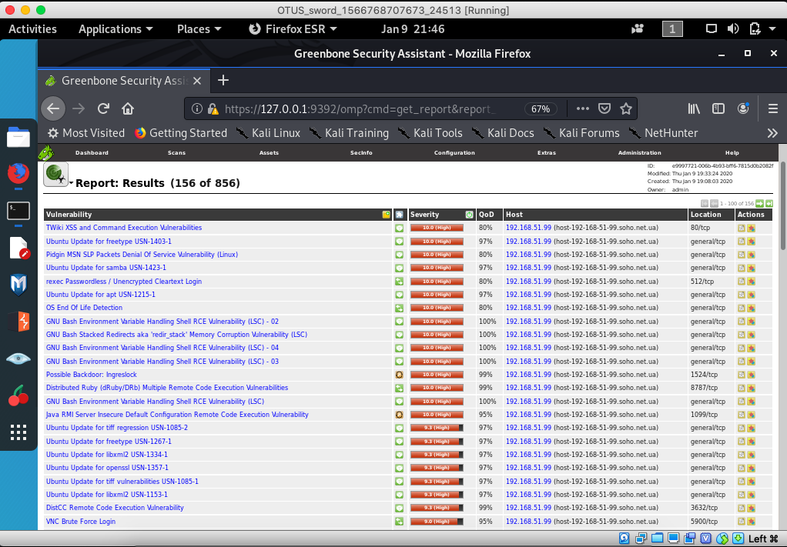

### С помощью установленного сканера безопасности OpenVAS проверить наличие уязвимостей ПО и ядра Linux на примере Metasploitable2 и прислать отчет.

Обновляем до последней редакции установленный Kali (sword - 192.168.51.66).  
apt-get update  
apt-get dist-upgrade  
apt-get autoremove  

Устанавливаем openvas.  
apt-get install openvas  

Запускаем первоначальную установку (процесс не быстрый).  
Application | 02 - Vulnerability Analysis | openvas initial setup  
Записываем в файлик полученный пароль для пользователя admin.

Подготавливаем виртуальную машину Metasploitable2, используя загруженный образ диска Metasploitable.vmdk.  
Параметры: CPU:2; RAM:2GB; Network:eth0 (виртуальный адаптер хоста).  

Настраиваем сетевой интерфейс, редактируя файл /etc/network/interfaces:  
iface eth0 inet static  
address 192.168.51.99  
netmask 255.255.255.0  

/etc/init.d/networking restart  

Запускаем OpenVAS.
Application | 02 - Vulnerability Analysis | openvas start  
Авторизуемся и создаем Task Metasploitable2.  
Target: 192.168.51.99  
Credentials for ssh: msfadmin:msfadmin  
Сканирование портов: OpenVAS default  
Тип сканирования: Full and fast  

Выполняем запуск задачи нажав на иконку зеленой стрелки.  
Процесс тоже не быстрый...  

[Файл с отчетом](./openvas_report.txt)

