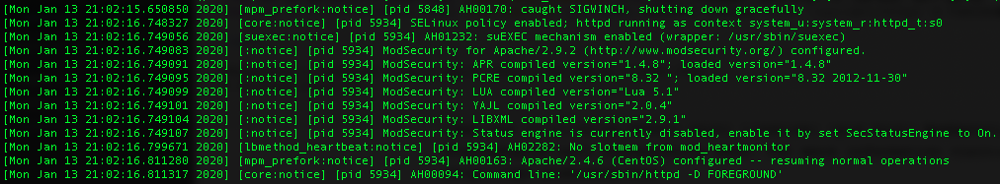
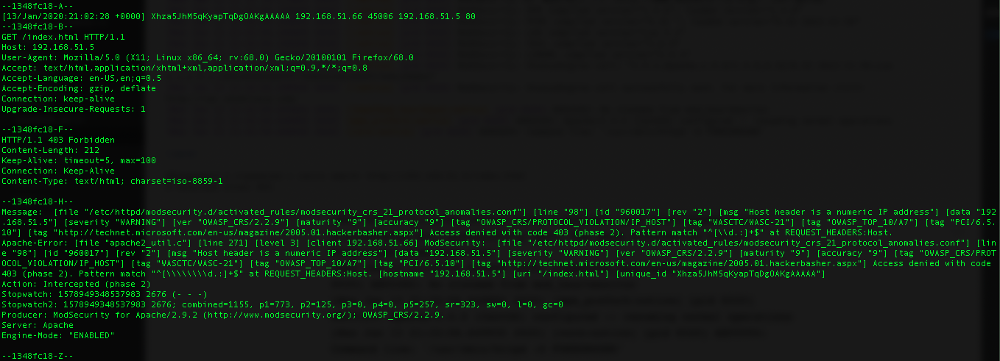
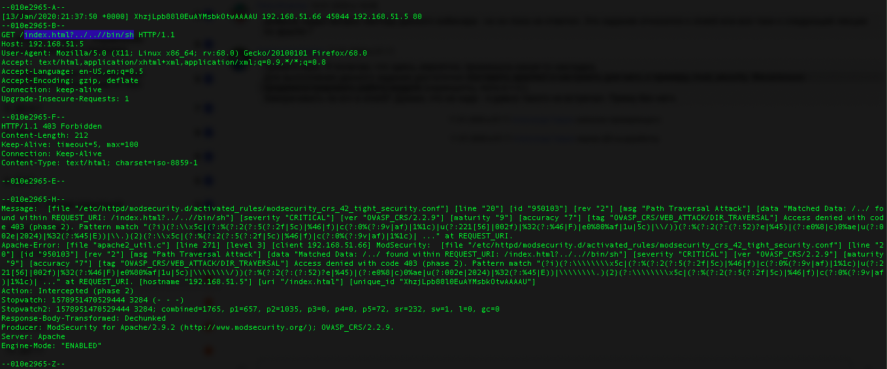

### Установка apache и настройка модуля mod_security.

Используем виртуальные машины для данного курса:  
CentOS7: shield 192.168.51.5 (будет установлен apache)  
Kali: sword 192.168.51.66 (буду тестировать подключение к apache)  

#### Установка и настройка apache.

<pre>
yum install httpd -y
Параметры, которые меняю/добавляю в стандартном конфиге /etc/httpd/conf/httpd.conf:
Listen 192.168.51.5:80
ServerName 192.168.51.5
ServerSignature Off
ServerTokens Prod

touch /var/www/html/index.html
</pre>

    <html><body>Hello World.</body></html>

<pre>
chown apache.apache /var/www/html/index.html
</pre>

#### Установка и настройка модуля mod_security.

<pre>
yum install mod_security mod_security_crs -y
mkdir /var/www/modsec/data
chown -R apache.apache /var/www/modsec

/etc/httpd/conf.d/00_mod_security.conf:
LoadModule security2_module modules/mod_security2.so
</pre>

    <IfModule mod_security2.c>
        SecRuleEngine On
        SecStatusEngine On
        SecAuditEngine RelevantOnly
        SecAuditLog /var/log/httpd/modsec_audit.log
        SecDebugLog /var/log/httpd/modsec_debug.log
        SecTmpDir /tmp
        SecDataDir /var/www/modsec/data
        Include modsecurity.d/modsecurity_crs_10_config.conf
        Include modsecurity.d/activated_rules/*.conf
    </IfModule>

#### Проверка работы

systemctl start httpd

Обращаемся к страничке с хоста sword: http://192.168.51.5/index.html  
И получаем отказ 403.  

Срабатывает правило 960017 - "Host header is a numeric IP address"  
Для того чтобы разрешить обращаться по IP-адресу необходимо закомментировать это правило в файле /usr/lib/modsecurity.d/base_rules/modsecurity_crs_21_protocol_anomalies.conf.  
Это будет строка 98.

<pre>
#SecRule REQUEST_HEADERS:Host "^[\d.:]+$" "phase:2,rev:'2',ver:'OWASP_CRS/2.2.9',maturity:'9',accuracy:'9',t:none,block,msg:'Host header is a numeric IP address',logdata:'%{matched_var}',severity:'4',id:'960017',tag:'OWASP_CRS/PROTOCOL_VIOLATION/IP_HOST',tag:'WASCTC/WASC-21',tag:'OWASP_TOP_10/A7',tag:'PCI/6.5.10',tag:'http://technet.microsoft.com/en-us/magazine/2005.01.hackerbasher.aspx',setvar:'tx.msg=%{rule.msg}',setvar:tx.anomaly_score=+%{tx.warning_anomaly_score},setvar:tx.%{rule.id}-OWASP_CRS/POLICY/IP_HOST-%{matched_var_name}=%{matched_var}"
</pre>

systemctl restart httpd  
http://192.168.51.5/index.html  
Hello World.

Теперь проверим срабатывание другого правила, срабатывающего на попытки обратиться к файловой системе напрямую.  
Например: http://192.168.51.5/index.html?../..//bin/sh  
И получае отказ 403.

