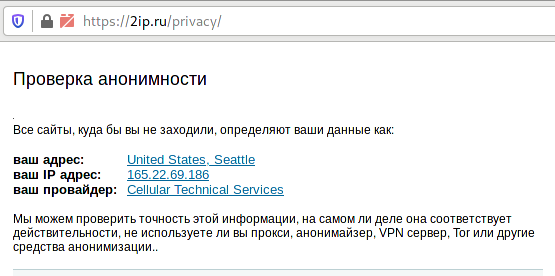

### Установка защищенного stunnel OpenVPN-сервера.

Регистрируемся на облачной платформе виртуализации https://digitalocean.com.  
Создаем виртуалку CentOS7 для сервера выбрав следующую конфигурацию из предложенных (CPU:2;RAM:2GB;HDD:60GB;NET:3TB).  
Создаем пару ключей для ssh и копируем публичный на сервер.  
Заходим на сервер по ключу и обновляем сервер.  
yum update -y  
yum install epel-release -y  
yum update -y  
Отключем SELINUX в файле /etc/sysconfig/selinux, ставим disabled.  
reboot  

<pre>
yum install iptables-services openvpn unzip -y  
yum install easy-rsa -y  
cd /usr/share/easy-rsa/3  
vi vars
cat vars
 set_var EASYRSA_DN		"cn_only"
 set_var EASYRSA_ALGO		ec
 set_var EASYRSA_CURVE		secp521r1
 set_var EASYRSA_CA_EXPIRE	3650
 set_var EASYRSA_CERT_EXPIRE	3650
 set_var EASYRSA_CRL_DAYS	3650
export EASYRSA_VARS_FILE=/usr/share/easy-rsa/3/vars
./easyrsa init-pki
./easyrsa --batch build-ca nopass
./easyrsa build-server-full openvpn-server nopass
./easyrsa build-client-full openvpn-client nopass

[root@ovpn 3]# ./easyrsa init-pki

Note: using Easy-RSA configuration from: /usr/share/easy-rsa/3/vars

init-pki complete; you may now create a CA or requests.
Your newly created PKI dir is: /usr/share/easy-rsa/3/pki

[root@ovpn 3]# ./easyrsa --batch build-ca nopass
read EC key
writing EC key
[root@ovpn 3]# ./easyrsa build-server-full openvpn-server nopass

Note: using Easy-RSA configuration from: /usr/share/easy-rsa/3/vars

Using SSL: openssl OpenSSL 1.0.2k-fips  26 Jan 2017
Generating a 521 bit EC private key
writing new private key to '/usr/share/easy-rsa/3/pki/private/openvpn-server.key.O5cCsaqMGT'
-----
Using configuration from /usr/share/easy-rsa/3/pki/safessl-easyrsa.cnf
Check that the request matches the signature
Signature ok
The Subject's Distinguished Name is as follows
commonName            :ASN.1 12:'openvpn-server'
Certificate is to be certified until Jan 12 20:47:39 2030 GMT (3650 days)

Write out database with 1 new entries
Data Base Updated
[root@ovpn 3]# ./easyrsa build-client-full openvpn-client nopass

Note: using Easy-RSA configuration from: /usr/share/easy-rsa/3/vars

Using SSL: openssl OpenSSL 1.0.2k-fips  26 Jan 2017
Generating a 521 bit EC private key
writing new private key to '/usr/share/easy-rsa/3/pki/private/openvpn-client.key.NBujRjvjcx'
-----
Using configuration from /usr/share/easy-rsa/3/pki/safessl-easyrsa.cnf
Check that the request matches the signature
Signature ok
The Subject's Distinguished Name is as follows
commonName            :ASN.1 12:'openvpn-client'
Certificate is to be certified until Jan 12 20:47:56 2030 GMT (3650 days)

Write out database with 1 new entries
Data Base Updated

cp -p pki/ca.crt pki/private/openvpn-server.key pki/issued/openvpn-server.crt /etc/openvpn/server/
cp -p pki/ca.crt pki/private/openvpn-client.key pki/issued/openvpn-client.crt /tmp/

cd /etc/openvpn/server
openvpn --genkey --secret ta.key
cp -p ta.key /tmp/

/etc/openvpn/server/openvpn-server.conf:
local 127.0.0.1
port 1194
proto tcp
dev tun
ca ca.crt
cert openvpn-server.crt
key openvpn-server.key
dh none
tls-auth ta.key 0
tls-cipher TLS-ECDHE-ECDSA-WITH-AES-256-GCM-SHA384:TLS-ECDHE-ECDSA-WITH-CHACHA20-POLY1305-SHA256
cipher none
server 10.8.8.0 255.255.255.0
push "redirect-gateway def1"
push "route 165.22.69.186 255.255.255.255 net_gateway"
push "dhcp-option DNS 8.8.8.8"
push "dhcp-option DNS 8.8.4.4"
duplicate-cn
keepalive 10 120
user nobody
group nobody
persist-key
persist-tun
status /dev/null
log /dev/null
verb 0

systemctl start openvpn-server@openvpn-server
systemctl status openvpn-server@openvpn-server

● openvpn-server@openvpn-server.service - OpenVPN service for openvpn/server
   Loaded: loaded (/usr/lib/systemd/system/openvpn-server@.service; disabled; vendor preset: disabled)
   Active: active (running) since Wed 2020-01-15 21:23:28 UTC; 6s ago
     Docs: man:openvpn(8)
           https://community.openvpn.net/openvpn/wiki/Openvpn24ManPage
           https://community.openvpn.net/openvpn/wiki/HOWTO
 Main PID: 9033 (openvpn)
   Status: "Initialization Sequence Completed"
   CGroup: /system.slice/system-openvpn\x2dserver.slice/openvpn-server@openvpn-server.service
           └─9033 /usr/sbin/openvpn --status /run/openvpn-server/status-openvpn-server.log --status-version 2 --suppress-timestamps --config openvpn-server.conf

Jan 15 21:23:28 ovpn systemd[1]: Starting OpenVPN service for openvpn/server...
Jan 15 21:23:28 ovpn systemd[1]: Started OpenVPN service for openvpn/server.

systemctl enable openvpn-server@openvpn-server

https://pkgs.org/download/stunnel

cd
curl -O -L https://dl.iuscommunity.org/pub/ius/stable/CentOS/7/x86_64//stunnel5u-5.44-1.ius.centos7.x86_64.rpm
rpm -ivh stunnel5u-5.44-1.ius.centos7.x86_64.rpm
useradd -d /var/stunnel -m -s /bin/false stunnel
/etc/stunnel/stunnel.conf:
chroot = /var/stunnel
setuid = stunnel
setgid = stunnel
pid = /stunnel.pid
debug = 0
socket = l:TCP_NODELAY=1
socket = r:TCP_NODELAY=1
curve = secp521r1
sslVersion = all
options = NO_SSLv2
options = NO_SSLv3
[openvpn]
accept = 443
connect = 127.0.0.1:1194
renegotiation = no
ciphers = ECDHE-RSA-AES256-GCM-SHA384:ECDHE-RSA-CHACHA20-POLY1305:ECDHE-RSA-AES256-SHA
cert = /etc/stunnel/stunnel-server.crt
key = /etc/stunnel/stunnel-server.key
CAfile = /etc/stunnel/clients.crt
verifyPeer = yes

cd /etc/stunnel
openssl req -newkey rsa:2048 -nodes -keyout stunnel-server.key -x509 -days 3650 -subj "/CN=stunnel-server" -out stunnel-server.crt
openssl req -newkey rsa:2048 -nodes -keyout client-desktop.key -x509 -days 3650 -subj "/CN=client-desktop" -out client-desktop.crt
openssl req -newkey rsa:2048 -nodes -keyout client-mobile.key -x509 -days 3650 -subj "/CN=client-mobile" -out client-mobile.crt
openssl pkcs12 -export -in client-mobile.crt -inkey client-mobile.key -out client-mobile.p12
Вводим и запоминаем пароль.
cat client-desktop.crt client-mobile.crt > clients.crt

systemctl start stunnel

[root@ovpn stunnel]# systemctl status stunnel
● stunnel.service - TLS tunnel for network daemons
   Loaded: loaded (/usr/lib/systemd/system/stunnel.service; disabled; vendor preset: disabled)
   Active: active (running) since Thu 2020-01-16 22:39:16 UTC; 4s ago
  Process: 18227 ExecStart=/usr/bin/stunnel (code=exited, status=0/SUCCESS)
 Main PID: 18228 (stunnel)
   CGroup: /system.slice/stunnel.service
           └─18228 /usr/bin/stunnel

Jan 16 22:39:16 ovpn systemd[1]: Starting TLS tunnel for network daemons...
Jan 16 22:39:16 ovpn systemd[1]: Started TLS tunnel for network daemons.

systemctl enable stunnel

cp -p client-* stunnel-server.crt /tmp/

/etc/sysctl.conf:
net.ipv4.ip_forward = 1
sysctl -p

systemctl start iptables
iptables -I INPUT 5 -p tcp -m state --state NEW -m tcp --dport 443 -j ACCEPT
iptables -I FORWARD 1 -m state --state RELATED,ESTABLISHED -j ACCEPT
iptables -I FORWARD 2 -i tun+ -s 10.8.8.0/24 -j ACCEPT
iptables -t nat -A POSTROUTING -s 10.8.8.0/24 -o eth0 -j SNAT --to-source 165.22.69.186
iptables-save > /etc/sysconfig/iptables

[root@ovpn etc]# iptables -L -v -n
Chain INPUT (policy ACCEPT 0 packets, 0 bytes)
 pkts bytes target     prot opt in     out     source               destination         
  628 47773 ACCEPT     all  --  *      *       0.0.0.0/0            0.0.0.0/0            state RELATED,ESTABLISHED
    0     0 ACCEPT     icmp --  *      *       0.0.0.0/0            0.0.0.0/0           
    0     0 ACCEPT     all  --  lo     *       0.0.0.0/0            0.0.0.0/0           
    8   468 ACCEPT     tcp  --  *      *       0.0.0.0/0            0.0.0.0/0            state NEW tcp dpt:22
    1    40 ACCEPT     tcp  --  *      *       0.0.0.0/0            0.0.0.0/0            state NEW tcp dpt:443
   72  3676 REJECT     all  --  *      *       0.0.0.0/0            0.0.0.0/0            reject-with icmp-host-prohibited

Chain FORWARD (policy ACCEPT 0 packets, 0 bytes)
 pkts bytes target     prot opt in     out     source               destination         
    0     0 ACCEPT     all  --  *      *       0.0.0.0/0            0.0.0.0/0            state RELATED,ESTABLISHED
    0     0 ACCEPT     all  --  tun+   *       10.8.8.0/24          0.0.0.0/0           
    0     0 REJECT     all  --  *      *       0.0.0.0/0            0.0.0.0/0            reject-with icmp-host-prohibited

Chain OUTPUT (policy ACCEPT 104 packets, 12860 bytes)
 pkts bytes target     prot opt in     out     source               destination

[root@ovpn etc]# iptables -L -v -n -t nat
Chain PREROUTING (policy ACCEPT 13 packets, 644 bytes)
 pkts bytes target     prot opt in     out     source               destination         

Chain INPUT (policy ACCEPT 1 packets, 60 bytes)
 pkts bytes target     prot opt in     out     source               destination         

Chain OUTPUT (policy ACCEPT 3 packets, 247 bytes)
 pkts bytes target     prot opt in     out     source               destination         

Chain POSTROUTING (policy ACCEPT 3 packets, 247 bytes)
 pkts bytes target     prot opt in     out     source               destination         
    0     0 SNAT       all  --  *      eth0    10.8.8.0/24          0.0.0.0/0            to:165.22.69.186

scp root@165.22.69.186:"/tmp/{ca.crt,ta.key,openvpn-client.crt,openvpn-client.key}" .
scp root@165.22.69.186:"/tmp/{stunnel-server.crt,client-*}" .

sudo dnf install stunnel -y
sudo cp /media/sf_Temp/ovpn/{client-*,stunnel-server.crt} /etc/stunnel
chmod 644 *.crt
chmod 600 *.key

/etc/stunnel/stunnel.conf:
[openvpn]
client = yes
accept = 127.0.0.1:1194
connect = 165.22.69.186:443
verifyPeer = yes
CAfile = /etc/stunnel/stunnel-server.crt
cert = /etc/stunnel/client-desktop.crt
key = /etc/stunnel/client-desktop.key

sudo systemctl start stunnel
sudo systemctl status stunnel

● stunnel.service - TLS tunnel for network daemons
   Loaded: loaded (/usr/lib/systemd/system/stunnel.service; disabled; vendor preset: disabled)
   Active: active (running) since Fri 2020-01-17 11:44:22 EET; 4s ago
  Process: 4867 ExecStart=/usr/bin/stunnel (code=exited, status=0/SUCCESS)
 Main PID: 4868 (stunnel)
    Tasks: 2 (limit: 4684)
   Memory: 1.2M
   CGroup: /system.slice/stunnel.service
           └─4868 /usr/bin/stunnel

янв 17 11:44:22 localhost.localdomain systemd[1]: Starting TLS tunnel for network daemons...
янв 17 11:44:22 localhost.localdomain stunnel[4867]: LOG5[ui]: stunnel 5.50 on x86_64-redhat-linux-gnu platform
янв 17 11:44:22 localhost.localdomain stunnel[4867]: LOG5[ui]: Compiled with OpenSSL 1.1.1 FIPS  11 Sep 2018
янв 17 11:44:22 localhost.localdomain stunnel[4867]: LOG5[ui]: Running  with OpenSSL 1.1.1d FIPS  10 Sep 2019
янв 17 11:44:22 localhost.localdomain stunnel[4867]: LOG5[ui]: Threading:PTHREAD Sockets:POLL,IPv6 TLS:ENGINE,FIPS,OCSP,PSK,SNI
янв 17 11:44:22 localhost.localdomain stunnel[4867]: LOG5[ui]: Reading configuration from file /etc/stunnel/stunnel.conf
янв 17 11:44:22 localhost.localdomain stunnel[4867]: LOG5[ui]: UTF-8 byte order mark not detected
янв 17 11:44:22 localhost.localdomain stunnel[4867]: LOG5[ui]: FIPS mode disabled
янв 17 11:44:22 localhost.localdomain stunnel[4867]: LOG5[ui]: Configuration successful
янв 17 11:44:22 localhost.localdomain systemd[1]: Started TLS tunnel for network daemons.

sudo install openvpn -y
sudo cp /media/sf_Temp/ovpn/{openvpn-client*,ca.crt,ta.key} /etc/openvpn/client
cd /etc/openvpn/client
chmod 644 *.crt
chmod 600 *.key

/etc/openvpn/client/openvpn-client.conf:
client
dev tun
proto tcp
remote 127.0.0.1 1194
resolv-retry infinite
nobind
user nobody
group nobody
persist-key
persist-tun
ca ca.crt
cert openvpn-client.crt
key openvpn-client.key
tls-auth ta.key 1
remote-cert-tls server
cipher none
verb 3

systemctl start openvpn-client@openvpn-client
systemctl status openvpn-client@openvpn-client

● openvpn-client@openvpn-client.service - OpenVPN tunnel for openvpn/client
   Loaded: loaded (/usr/lib/systemd/system/openvpn-client@.service; disabled; vendor preset: disabled)
   Active: active (running) since Fri 2020-01-17 12:37:58 EET; 4s ago
     Docs: man:openvpn(8)
           https://community.openvpn.net/openvpn/wiki/Openvpn24ManPage
           https://community.openvpn.net/openvpn/wiki/HOWTO
 Main PID: 5278 (openvpn)
   Status: "Initialization Sequence Completed"
    Tasks: 1 (limit: 4684)
   Memory: 3.2M
   CGroup: /system.slice/system-openvpn\x2dclient.slice/openvpn-client@openvpn-client.service
           └─5278 /usr/sbin/openvpn --suppress-timestamps --nobind --config openvpn-client.conf

янв 17 12:38:00 localhost.localdomain openvpn[5278]: /sbin/ip addr add dev tun0 local 10.8.8.6 peer 10.8.8.5
янв 17 12:38:00 localhost.localdomain openvpn[5278]: /sbin/ip route add 127.0.0.1/32 via 10.0.2.2
янв 17 12:38:00 localhost.localdomain openvpn[5278]: /sbin/ip route add 0.0.0.0/1 via 10.8.8.5
янв 17 12:38:00 localhost.localdomain openvpn[5278]: /sbin/ip route add 128.0.0.0/1 via 10.8.8.5
янв 17 12:38:00 localhost.localdomain openvpn[5278]: /sbin/ip route add 165.22.69.186/32 via 10.0.2.2
янв 17 12:38:00 localhost.localdomain openvpn[5278]: /sbin/ip route add 10.8.8.1/32 via 10.8.8.5
янв 17 12:38:00 localhost.localdomain openvpn[5278]: GID set to nobody
янв 17 12:38:00 localhost.localdomain openvpn[5278]: UID set to nobody
янв 17 12:38:00 localhost.localdomain openvpn[5278]: WARNING: this configuration may cache passwords in memory -- use the auth-nocache option to prevent this
янв 17 12:38:00 localhost.localdomain openvpn[5278]: Initialization Sequence Completed

На Fedora есть проблемы с назначением DNS серверов (указанных в директивах PUSH).
Чтобы не тратить время на эту проблему, я просто добавил google-DNS в файл /etc/resolv.conf.

[root@localhost etc]# curl https://2ip.ru
165.22.69.186

</pre>

#### Проверка анонимности

  

