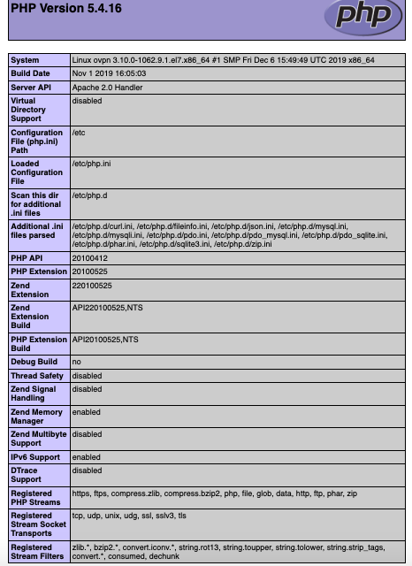
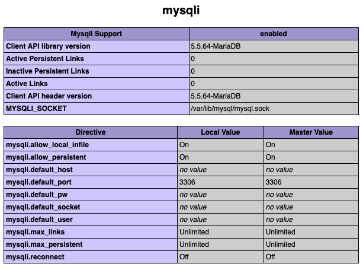
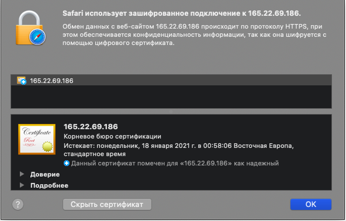
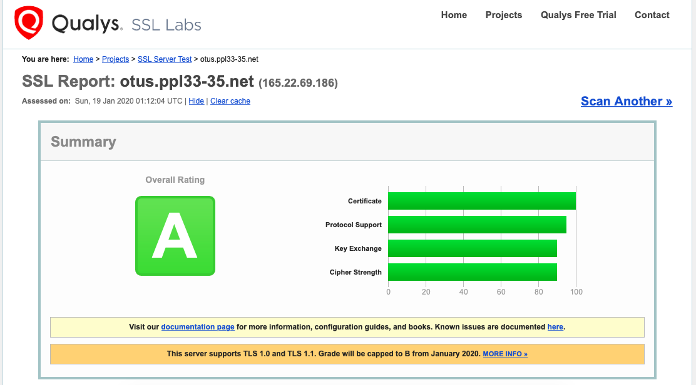
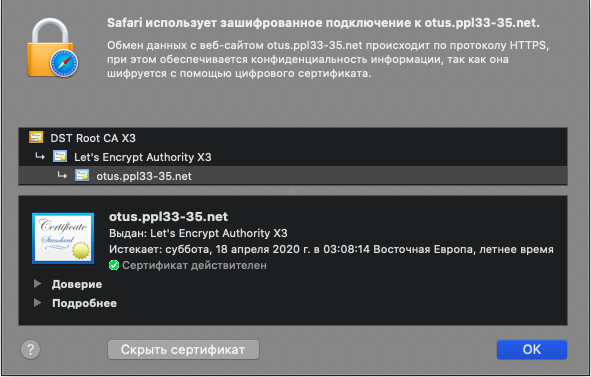

### Использование серверных и клиентских сертификатов на примере Web-приложения на базе Apache

#### 1. Установить и настроить сервер LAMP.

##### (L) 
Установка будет выполнена на арендованной виртуалке CentOS 7 в облаке DigitalOcean (165.22.69.186).  

##### (A) 
Установка вэб-сервера Apache:  
yum install httpd -y

Параметры, которые меняю/добавляю в стандартном конфиге /etc/httpd/conf/httpd.conf:  
Listen 165.22.69.186:80  
ServerName 165.22.69.186  
ServerSignature Off  
ServerTokens Prod  

    echo "<html><body>Hello World.</body></html>" > /var/www/html/index.html 
chown apache.apache /var/www/html/index.html  

iptables -I INPUT 6 -p tcp -m state --state NEW -m tcp --dport 80 -j ACCEPT
iptables-save > /etc/sysconfig/iptables

systemctl start httpd
systemctl enable httpd

##### (M)
yum install mariadb-server mariadb -y  
systemctl start mariadb  
Первоначальная настройка базы: 
mysql_secure_installation  
Устанавливаем рутовый пароль на базу и "Y" на все остальные вопросы.  
systemctl enable mariadb  

##### (P)
yum install php php-mysql -y  
systemctl restart httpd  
echo "<?php phpinfo(); ?>" > /var/www/html/info.php
chown apache.apache /var/www/html/info.php  

http://165.22.69.186/info.php

  

#### 2. Настройка сайта с самоподписанным сертификатом

<pre>

yum install mod_ssl -y

iptables -I INPUT 7 -p tcp -m state --state NEW -m tcp --dport 443 -j ACCEPT
iptables-save > /etc/sysconfig/iptables

cd /etc/pki/tls/certs
make testcert

umask 77 ; \
/usr/bin/openssl genrsa -aes128 2048 > /etc/pki/tls/private/localhost.key
Generating RSA private key, 2048 bit long modulus
...............................................+++
.......................................+++
e is 65537 (0x10001)
Enter pass phrase:
Verifying - Enter pass phrase:
umask 77 ; \
/usr/bin/openssl req -utf8 -new -key /etc/pki/tls/private/localhost.key -x509 -days 365 -out /etc/pki/tls/certs/localhost.crt 
Enter pass phrase for /etc/pki/tls/private/localhost.key:
You are about to be asked to enter information that will be incorporated
into your certificate request.
What you are about to enter is what is called a Distinguished Name or a DN.
There are quite a few fields but you can leave some blank
For some fields there will be a default value,
If you enter '.', the field will be left blank.
-----
Country Name (2 letter code) [XX]:UA
State or Province Name (full name) []:Odessa
Locality Name (eg, city) [Default City]:Odessa
Organization Name (eg, company) [Default Company Ltd]:OTUS
Organizational Unit Name (eg, section) []:IT
Common Name (eg, your name or your server's hostname) []:165.22.69.186
Email Address []:root@localhost

Чтобы не спрашивал пароль при запуске или перезапуске:
cd /etc/pki/tls/private/
cp localhost.key localhost.key.org
openssl rsa -in localhost.key.org -out localhost.key
Enter pass phrase for localhost.key.org:
writing RSA key

systemctl restart httpd

</pre>

 

#### 3. * СОЗДАНИЕ СЕРТИФИКАТА LET’S ENCRYPT

Мое зарегистрированное имя: otus.ppl33-35.net (165.22.69.186)  

<pre>
Параметры, которые меняю/добавляю в стандартном конфиге /etc/httpd/conf/httpd.conf:   
ServerName otus.ppl33-35.net
</pre>

    <VirtualHost *:80>
        ServerName otus.ppl33-35.net
    </VirtualHost>

Параметры, которые меняю/добавляю в стандартном конфиге /etc/httpd/conf.d/ssl.conf:
В разделе 

    <VirtualHost _default_:443>

<pre>
DocumentRoot "/var/www/html"
ServerName otus.ppl33-35.net:443

yum install certbot python2-certbot-apache -y
certbot --apache -d otus.ppl33-35.net

</pre>

  

