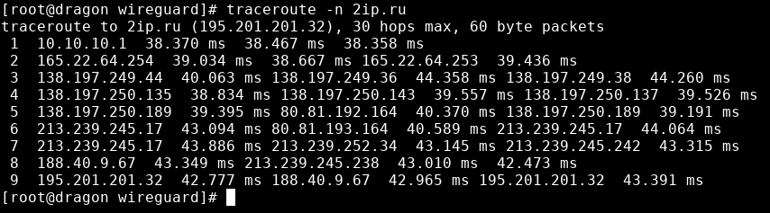

### Wireguard (Fedora -> CentOS7)

#### Сервер

<pre>

curl -Lo /etc/yum.repos.d/wireguard.repo https://copr.fedorainfracloud.org/coprs/jdoss/wireguard/repo/epel-7/jdoss-wireguard-epel-7.repo
yum install wireguard-tools wireguard-dkms -y
modprobe wireguard
echo wireguard > /etc/modprobe.d/wireguard.conf
iptables -I INPUT 7 -p udp -m udp --dport 54321 -j ACCEPT
iptables-save > /etc/sysconfig/iptables
mkdir /etc/wireguard && cd /etc/wireguard && bash -c 'umask 077; touch wg0-server.conf'
umask 077
wg genkey > /etc/wireguard/private-server.key
wg pubkey < /etc/wireguard/private-server.key > public-server.key
wg genkey > /etc/wireguard/private-client.key
wg pubkey < /etc/wireguard/private-client.key > public-client.key

wg0-server.conf:
[Interface]
Address = 10.10.10.1/24
PostUp = iptables -I FORWARD 3 -i %i -j ACCEPT; iptables -I FORWARD 4 -o %i -j ACCEPT; iptables -t nat -A POSTROUTING -s 10.10.10.0/24 -o eth0 -j SNAT --to-source 165.22.69.186
PostDown = iptables -D FORWARD -i %i -j ACCEPT; iptables -D FORWARD -o %i -j ACCEPT; iptables -t nat -D POSTROUTING -s 10.10.10.0/24 -o eth0 -j SNAT --to-source 165.22.69.186
ListenPort = 54321
PrivateKey = <содержимое private-server.key>

[Peer]
PublicKey = <содержимое public-client.key>
AllowedIPs = 10.10.10.2/32

systemctl start wg-quick@wg0-server
systemctl status wg-quick@wg0-server
● wg-quick@wg0-server.service - WireGuard via wg-quick(8) for wg0/server
   Loaded: loaded (/usr/lib/systemd/system/wg-quick@.service; disabled; vendor preset: disabled)
   Active: active (exited) since Sun 2020-01-19 22:20:39 UTC; 1s ago
     Docs: man:wg-quick(8)
           man:wg(8)
           https://www.wireguard.com/
           https://www.wireguard.com/quickstart/
           https://git.zx2c4.com/WireGuard/about/src/tools/man/wg-quick.8
           https://git.zx2c4.com/WireGuard/about/src/tools/man/wg.8
  Process: 28405 ExecStart=/usr/bin/wg-quick up %i (code=exited, status=0/SUCCESS)
 Main PID: 28405 (code=exited, status=0/SUCCESS)

Jan 19 22:20:39 ovpn systemd[1]: Starting WireGuard via wg-quick(8) for wg0/server...
Jan 19 22:20:39 ovpn wg-quick[28405]: [#] ip link add wg0-server type wireguard
Jan 19 22:20:39 ovpn wg-quick[28405]: [#] wg setconf wg0-server /dev/fd/63
Jan 19 22:20:39 ovpn wg-quick[28405]: [#] ip -4 address add 10.10.10.1/24 dev wg0-server
Jan 19 22:20:39 ovpn wg-quick[28405]: [#] ip link set mtu 1420 up dev wg0-server
Jan 19 22:20:39 ovpn wg-quick[28405]: [#] iptables -I FORWARD 3 -i wg0-server -j ACCEPT; iptables -I FORWARD 4 -o wg0-server -j ACCEPT; iptables -t nat -A POSTROUTING -s 10.10.1...165.22.69.186
Jan 19 22:20:39 ovpn systemd[1]: Started WireGuard via wg-quick(8) for wg0/server.

</pre>

#### Клиент

<pre>

dnf copr enable jdoss/wireguard
dnf install wireguard-dkms wireguard-tools
modprobe wireguard
mkdir -p /etc/wireguard
cd /etc/wireguard

vi wg0-client.conf
[Interface]
Address = 10.10.10.2/24
PrivateKey = CLIENT_PRIVATE_KEY
DNS = 8.8.8.8

[Peer]
PublicKey = SERVER_PUBLIC_KEY
Endpoint = 165.22.69.186:54321
AllowedIPs = 0.0.0.0/0
PersistentKeepalive = 21

chmod 600 wg0-client.conf

wg-quick up wg0-client
[#] ip link add wg0-client type wireguard
[#] wg setconf wg0-client /dev/fd/63
[#] ip -4 address add 10.10.10.2/24 dev wg0-client
[#] ip link set mtu 1420 up dev wg0-client
[#] mount `8.8.8.8' /etc/resolv.conf
[#] wg set wg0-client fwmark 51820
[#] ip -4 route add 0.0.0.0/0 dev wg0-client table 51820
[#] ip -4 rule add not fwmark 51820 table 51820
[#] ip -4 rule add table main suppress_prefixlength 0
[#] sysctl -q net.ipv4.conf.all.src_valid_mark=1
[#] nft -f /dev/fd/63

</pre>

<pre>
wg-quick down wg0-client
[#] ip -4 rule delete table 51820
[#] ip -4 rule delete table main suppress_prefixlength 0
[#] ip link delete dev wg0-client
[#] umount /etc/resolv.conf
[#] nft -f /dev/fd/63

</pre>